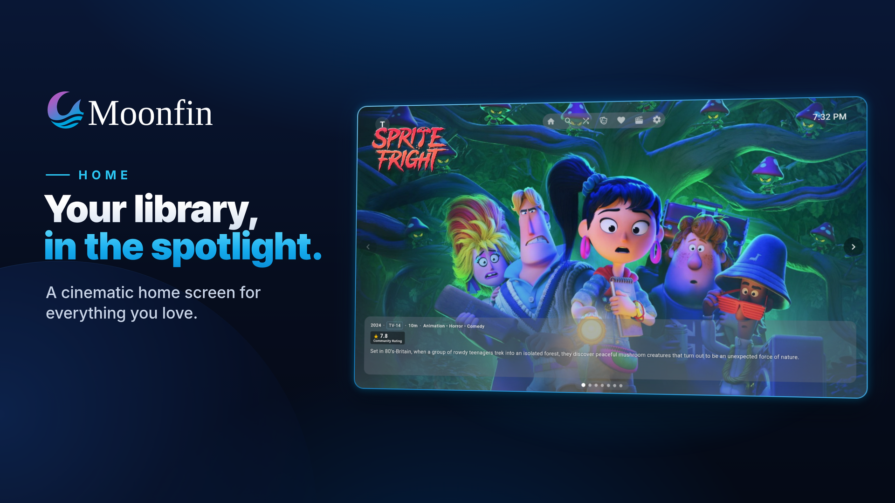
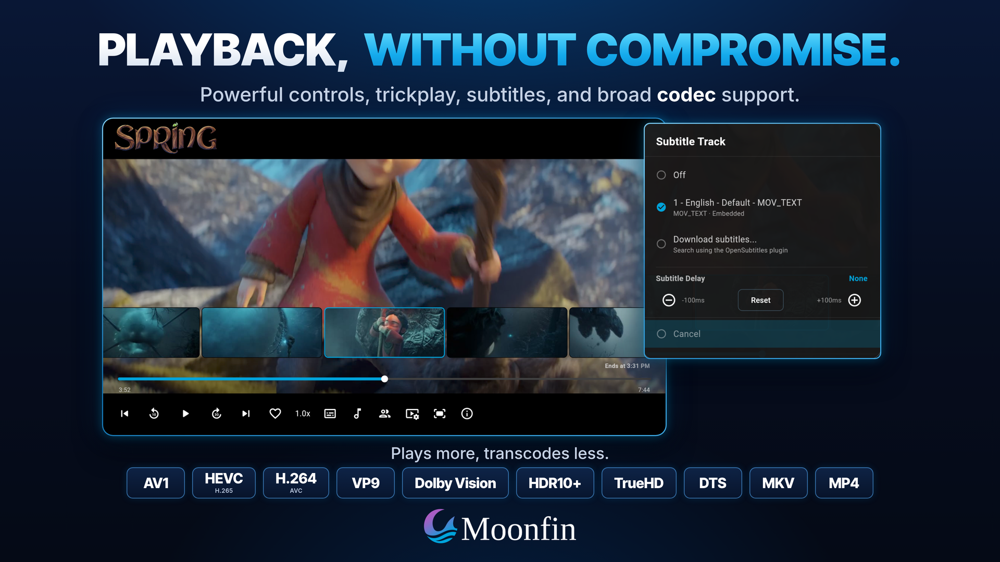
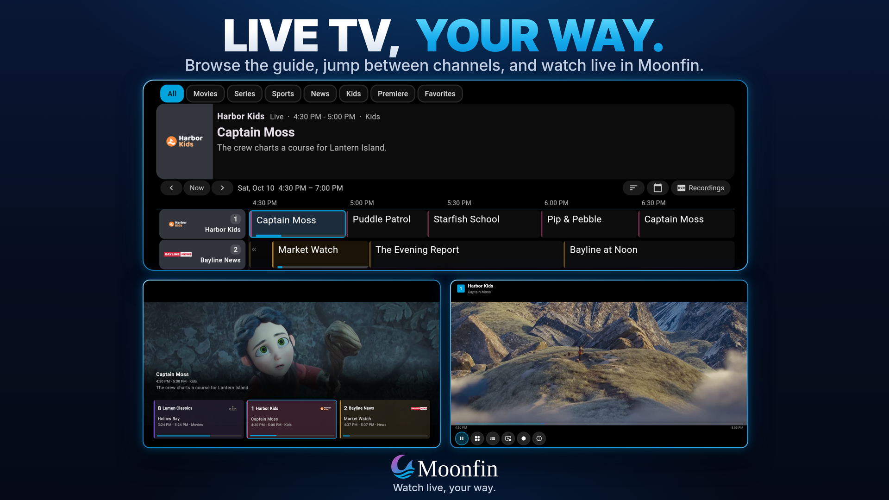
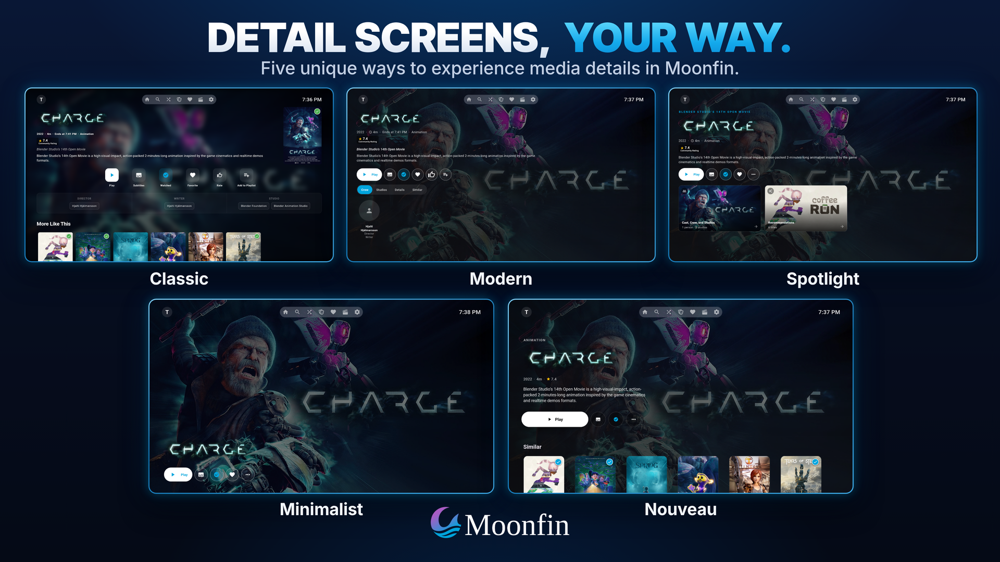
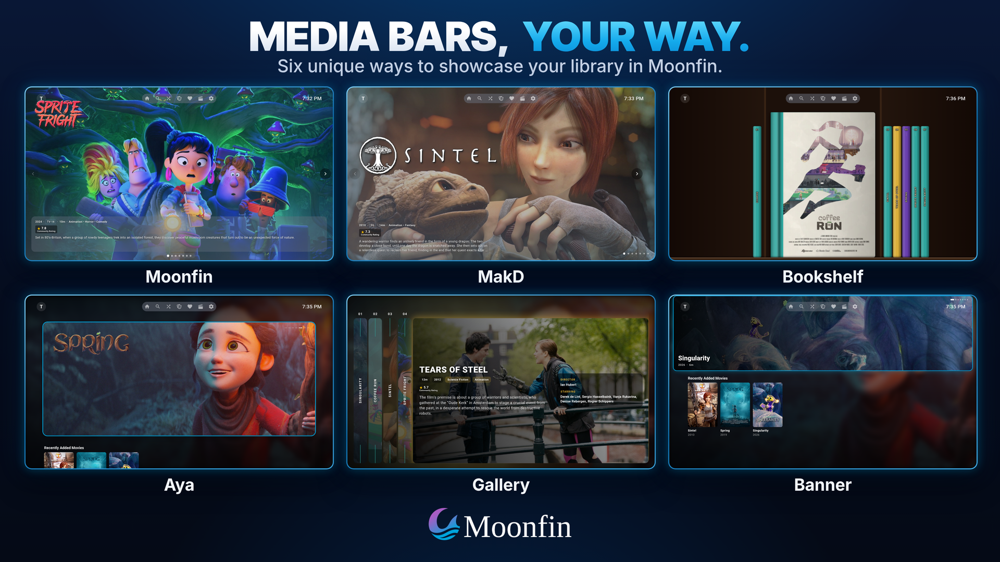
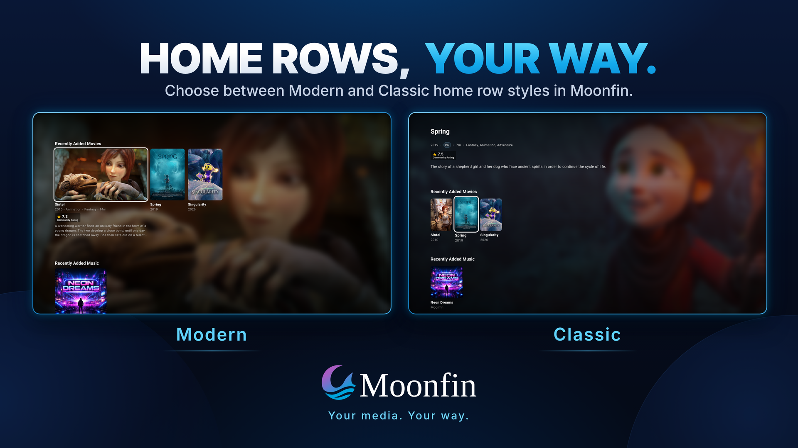
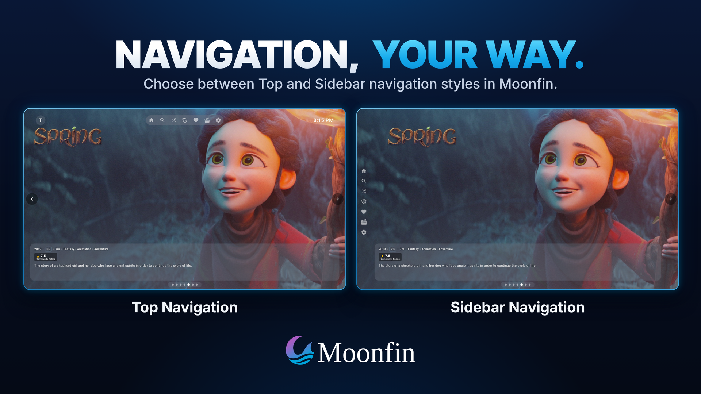
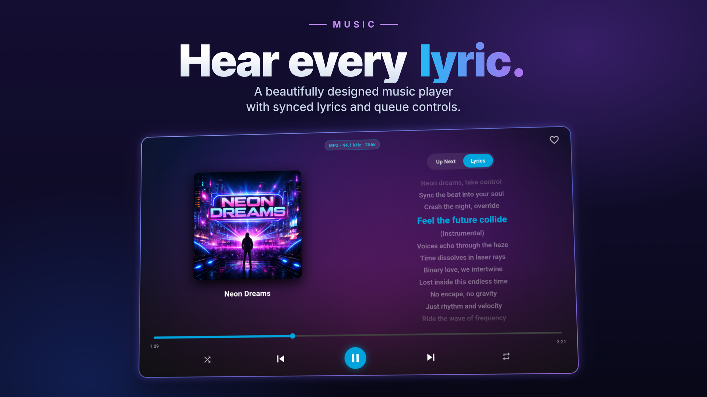

<h1 align="center">Moonfin for Roku</h1>
<h3 align="center">Premium Jellyfin and Emby client for Roku TV, Roku Streaming Stick, Roku Ultra, and Roku Express devices</h3>

---

<p align="center">
   
</p>

[](LICENSE)
[](https://github.com/Moonfin-Client/Roku/releases)
[](https://channelstore.roku.com/details/92a83c9f4112b76a7bcee3dc076254ca:3251a91bf7af7339652d5409ccfdcb39/moonfin) 
[](https://github.com/Moonfin-Client/Roku/releases)
[](https://www.buymeacoffee.com/moonfin)
[](https://discord.gg/moonfin)

> **[Back to main Moonfin project](https://github.com/Moonfin-Client)**

Moonfin for Roku is an enhanced fork of the official Jellyfin Roku client that works with both Jellyfin and Emby servers. It brings the full Moonfin experience to Roku hardware. It shares its look, screens, and settings with the other Moonfin clients, and it syncs your preferences through the Moonbase server plugin.

## Features

- **A modern home screen and detail screen**, both on by default. The focused row item grows into a landscape card with metadata and ratings. Detail pages get a cinematic tabbed layout with studio logos, chapters, and an Up Next card. The classic layouts stay selectable.
- **Themes**, with built-in Moonfin, Neon Pulse, and 8-Bit Hero looks, a community Theme Store, and server-shared themes. Your choice syncs across devices.
- **A featured media bar** with six styles: Moonfin, MakD, Banner, Gallery, Bookshelf, and the rounded Aya hero.
- **A home screen full of rows** you pick and order yourself, with no cap on how many. Choose from Seerr rows, IMDb and TMDB charts, Radarr and Sonarr calendars, Favorites, Collections, Genres, Playlists, Audio, Since You Watched, Rewatch, and Recently Released, plus rows for one specific collection, genre, or playlist. The whole layout syncs.
- **Seerr built into the detail screen.** Request in HD or 4K with smart season selection, track your requests and issues, filter NSFW content, and get Seerr results in global search. See [Seerr Setup](https://github.com/Moonfin-Client/Roku/wiki/Seerr-Setup).
- **Multi-server and Emby support**, including Emby Connect, Quick Connect, and seamless playback across your connected Jellyfin and Emby servers.
- **Settings sync** through the [Moonfin server plugin](https://github.com/Moonfin-Client/Plugin). Your theme, layouts, row order, hidden items, and much more follow you between devices.
- **Playback done right**: trickplay previews while scrubbing, pre-playback track selection, fast forward and rewind at 3x, 15x, and 50x, HDR10+ and Dolby Vision with fallbacks, manual subtitle sync, theme music, and rearrangeable player buttons.
- **A setup wizard on first run** that shows live previews built from your own artwork, and skips anything you have already chosen.
- **Ratings that follow your sources**, including TMDB episode ratings and extra sources like Letterboxd and MDBList through the plugin.
- **Quality of life everywhere**: an in-app keyboard that follows your language, in-library search with a full sort and filter dialog, a shuffle dialog with five picks at a time, an account switcher on the navigation bar avatar, inline Quick Connect at sign-in, and in-app diagnostic logging with a log viewer.

The full list is on the [Features](https://github.com/Moonfin-Client/Roku/wiki/Features) wiki page.

## Screenshots

<p align="center">
  
</p>
<p align="center">
  
  
</p>
<p align="center">
  
  
</p>
<p align="center">
  
  
</p>
<p align="center">
  
</p>

More in the [Screenshots](https://github.com/Moonfin-Client/Roku/wiki/Screenshots) gallery.

**Disclaimer:** Screenshots shown in this documentation feature media content, artwork, and actor likenesses for demonstration purposes only. None of the media, studios, actors, or other content depicted are affiliated with, sponsored by, or endorsing the Moonfin client or the Jellyfin project. All rights to the portrayed content belong to their respective copyright holders. These screenshots are used solely to demonstrate the functionality and interface of the application.

## Installation

**The easy way:** add [Moonfin](https://channelstore.roku.com/details/92a83c9f4112b76a7bcee3dc076254ca:3251a91bf7af7339652d5409ccfdcb39/moonfin) from the Roku Channel Store. It installs on your devices and updates itself from then on.

Moonfin needs Roku OS 9.1 or newer, which covers most Roku devices from 2018 onwards. Once it's installed, [Getting Started](https://github.com/Moonfin-Client/Roku/wiki/Getting-Started) walks through connecting to your server and signing in with Quick Connect or Emby Connect.

Seerr is optional. It connects through the [Moonfin server plugin](https://github.com/Moonfin-Client/Plugin), so there is nothing to type on the Roku. See [Seerr Setup](https://github.com/Moonfin-Client/Roku/wiki/Seerr-Setup).

<details>
<summary><b>Advanced:</b> sideloading the newest build</summary>

Sideloading gets you the newest build before it reaches the store. Download the latest `.zip` from the [Releases page](https://github.com/Moonfin-Client/Roku/releases) and install it through Roku Developer Mode.

Step-by-step instructions are on [Installation and Sideloading](https://github.com/Moonfin-Client/Roku/wiki/Installation-and-Sideloading).

</details>

## Building

```bash
git clone https://github.com/Moonfin-Client/Roku.git
cd Roku
npm install
npm run build
```

Node.js and npm are the only prerequisites. The output lands in `out/Moonfin_Roku_v{version}.zip`. Full details are on [Building from Source](https://github.com/Moonfin-Client/Roku/wiki/Building-from-Source).

## Documentation

The deeper reference material lives in the [Wiki](https://github.com/Moonfin-Client/Roku/wiki):

| Page | What it covers |
|------|----------------|
| [Features](https://github.com/Moonfin-Client/Roku/wiki/Features) | The full feature list, section by section |
| [Installation and Sideloading](https://github.com/Moonfin-Client/Roku/wiki/Installation-and-Sideloading) | The Channel Store, Developer Mode, sideloading, and supported devices |
| [Getting Started](https://github.com/Moonfin-Client/Roku/wiki/Getting-Started) | Picking your server, Quick Connect, the setup wizard, and the settings worth a look on day one |
| [User Guide](https://github.com/Moonfin-Client/Roku/wiki/User-Guide) | The remote inside the player, typing, finding things, Seerr requests, themes and home rows |
| [Common Problems](https://github.com/Moonfin-Client/Roku/wiki/Common-Problems) | Plain fixes for connection, sign-in, install, playback, sound, subtitle and sync trouble |
| [Seerr Setup](https://github.com/Moonfin-Client/Roku/wiki/Seerr-Setup) | Connecting Seerr through the Moonfin server plugin |
| [Building from Source](https://github.com/Moonfin-Client/Roku/wiki/Building-from-Source) | Toolchain, build steps, and deploying to a device |
| [Development](https://github.com/Moonfin-Client/Roku/wiki/Development) | Project structure, BrighterScript notes, and developer guidelines |

## Contributing

Contributions are welcome. Check the existing issues first, and open an issue before starting a large change. Match the existing code style, which `bsfmt.json` enforces, and test on real Roku hardware where you can. Features that would help all Jellyfin users are worth proposing upstream first.

To submit a change, fork the repo, create a feature branch, make your changes with clear commit messages, and open a pull request with a clear description.

## Help translate Moonfin [here](https://translate.moonfin.io/engage/roku/)

<a href="https://translate.moonfin.io/engage/roku/">
  
</a>

Translations contributed to Moonfin that are universally applicable will be submitted upstream to benefit the entire community.

## Support and Community

- **Issues** for bugs and feature requests: [GitHub Issues](https://github.com/Moonfin-Client/Roku/issues)
- **Discussions** for questions and ideas: [GitHub Discussions](https://github.com/Moonfin-Client/Roku/discussions)
- **Upstream Jellyfin** for server-related questions: [jellyfin.org](https://jellyfin.org)

## Credits

Moonfin for Roku is built upon the excellent work of:

- **[Jellyfin Project](https://jellyfin.org)** for the foundation and upstream codebase
- **[MakD](https://github.com/MakD)** for the original Jellyfin-Media-Bar concept that inspired our featured media bar
- **Jellyfin Roku Contributors** for the original client
- **Moonfin Contributors** for everything they have added to this fork

## License

This project inherits the GPL v2 license from the upstream Jellyfin Roku project. See the [LICENSE](LICENSE) file for details.

---

<p align="center">
   <strong>Moonfin for Roku</strong> is an independent fork and is not affiliated with the Jellyfin or Emby projects.<br>
   <a href="https://github.com/Moonfin-Client">Back to main Moonfin project</a>
</p>
